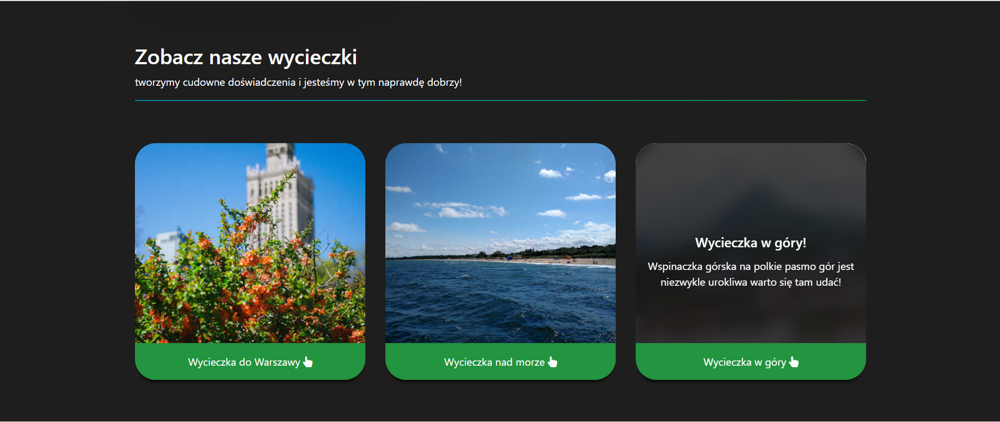

# Styczne-Tury
it is a website of fictional travel agency Styczne Tury https://styczne-tury.web.app/.
I created it using React. It uses React Router for routing and for optimatisation lazy loading. To install packages I used npm and webpack for connecting components. For styling purposes I used Bootstrap v4.5 and CSS.

